# Helix — System Architecture

Layered topology. Each band is a tier; arrows flow top-down across tier
boundaries. No cross-tier shortcuts — every renderer call crosses preload → main
→ bridge before reaching a provider or persistence.

```mermaid
%%{init: {
  "theme": "base",
  "themeVariables": {
    "fontFamily": "Inter, Segoe UI, system-ui, sans-serif",
    "fontSize": "13px",
    "primaryColor": "#1e293b",
    "primaryTextColor": "#f8fafc",
    "primaryBorderColor": "#475569",
    "lineColor": "#64748b",
    "clusterBkg": "#0f172a",
    "clusterBorder": "#334155"
  },
  "flowchart": {
    "curve": "linear",
    "htmlLabels": true,
    "nodeSpacing": 35,
    "rankSpacing": 55,
    "padding": 10
  }
}}%%
flowchart TB

    %% ══════════ TIER 1 · PRESENTATION ══════════
    subgraph T1["① &nbsp;Presentation &nbsp;·&nbsp; Renderer Process (Chromium)"]
        direction LR
        UI["<b>React UI</b><br/><span style='font-size:11px;opacity:.7'>renderer/</span>"]:::ui
        ZS["<b>Zustand Stores</b><br/><span style='font-size:11px;opacity:.7'>chat · workspace · settings</span>"]:::ui
        UI --- ZS
    end

    %% ══════════ TIER 2 · BRIDGE BOUNDARY ══════════
    subgraph T2["② &nbsp;Boundary &nbsp;·&nbsp; Preload (Isolated World)"]
        direction LR
        API["<b>window.ollamaDesktop</b> &nbsp;·&nbsp; contextBridge &nbsp;·&nbsp; Zod-typed"]:::bridge
    end

    %% ══════════ TIER 3 · PROCESS SHELL ══════════
    subgraph T3["③ &nbsp;Process Shell &nbsp;·&nbsp; Electron Main (Node)"]
        direction LR
        ENTRY["<b>main.ts</b><br/><span style='font-size:11px;opacity:.7'>BrowserWindow · splash · lifecycle</span>"]:::main
        IPC["<b>ipc/</b><br/><span style='font-size:11px;opacity:.7'>typed handlers</span>"]:::main
        ENTRY --> IPC
    end

    %% ══════════ TIER 4 · ORCHESTRATION ══════════
    subgraph T4["④ &nbsp;Orchestration &nbsp;·&nbsp; bridge/"]
        direction TB

        subgraph T4A["Core"]
            direction LR
            CTX["app-context<br/><span style='font-size:10px;opacity:.7'>DI root</span>"]:::svc
            CHAT["ChatService"]:::svc
            ROUT["router"]:::svc
            CTXA["context assembly"]:::svc
        end

        subgraph T4B["Knowledge &nbsp;&amp;&nbsp; Skills"]
            direction LR
            RAG["rag<br/><span style='font-size:10px;opacity:.7'>FTS5 + semantic</span>"]:::svc
            EMB["embeddings<br/><span style='font-size:10px;opacity:.7'>96-dim</span>"]:::svc
            MEM["memory"]:::svc
            SKL["skills loader"]:::svc
        end

        subgraph T4C["Execution"]
            direction LR
            TOOL["tools<br/><span style='font-size:10px;opacity:.7'>fs · exec · lsp · web</span>"]:::svc
            CAP["capabilities<br/><span style='font-size:10px;opacity:.7'>tasks · agents · audit</span>"]:::svc
            QUE["queue"]:::svc
            MCPS["mcp surface"]:::svc
        end

        T4A --> T4B
        T4A --> T4C
    end

    %% ══════════ TIER 5 · PROVIDER ADAPTERS ══════════
    subgraph T5["⑤ &nbsp;Provider Adapters"]
        direction LR
        OLL["<b>OllamaClient</b><br/><span style='font-size:10px;opacity:.7'>local · native tool-loop</span>"]:::prov
        NV["<b>NvidiaClient</b><br/><span style='font-size:10px;opacity:.7'>OpenAI-compat</span>"]:::prov
        GEN["<b>GenerationService</b><br/><span style='font-size:10px;opacity:.7'>image jobs</span>"]:::prov
        PYM["<b>PythonServerManager</b><br/><span style='font-size:10px;opacity:.7'>child-process lifecycle</span>"]:::prov
    end

    %% ══════════ TIER 6 · BACKENDS ══════════
    subgraph T6["⑥ &nbsp;Backends"]
        direction LR
        subgraph T6A["External"]
            direction TB
            OLLS["Ollama<br/><span style='font-size:10px;opacity:.7'>localhost:11434</span>"]:::ext
            NVAPI["NVIDIA API<br/><span style='font-size:10px;opacity:.7'>integrate.api.nvidia.com</span>"]:::ext
        end
        subgraph T6B["Python Sidecar &nbsp;·&nbsp; child process"]
            direction TB
            FAPI["<b>inference_server/</b> &nbsp;·&nbsp; FastAPI (localhost)"]:::py
            CFUI["<b>comfyui_backend/</b> &nbsp;·&nbsp; runner · job_queue · model_manager"]:::py
            PYRT["<b>python_embeded/</b> &nbsp;·&nbsp; python.exe"]:::py
            FAPI --> CFUI --> PYRT
        end
    end

    %% ══════════ TIER 7 · PERSISTENCE ══════════
    subgraph T7["⑦ &nbsp;Persistence &nbsp;·&nbsp; Local Filesystem"]
        direction LR
        SQL[("<b>SQLite</b> · WAL · FK on<br/><span style='font-size:10px;opacity:.7'>userData/data/ollama-desktop.sqlite</span>")]:::store
        SKF[("skills/<br/><span style='font-size:10px;opacity:.7'>builtin + user</span>")]:::store
        KN[("knowledge/<br/><span style='font-size:10px;opacity:.7'>RAG corpus</span>")]:::store
        ART[("userData/<br/><span style='font-size:10px;opacity:.7'>artifacts · logs · migrations</span>")]:::store
    end

    %% ───────── Cross-tier edges (top → down) ─────────
    T1 ==>|invoke| T2
    T2 ==>|IPC · Zod-validated| T3
    T3 ==>|dispatch| CHAT

    CHAT --> OLL
    CHAT --> NV
    CHAT --> GEN
    GEN  --> PYM

    OLL -->|HTTP| OLLS
    NV  -->|HTTPS| NVAPI
    PYM ==>|spawn · stdio| FAPI

    %% Persistence writes
    CHAT --> SQL
    CAP  --> SQL
    RAG  --> SQL
    GEN  --> SQL
    SKL  --- SKF
    RAG  --- KN
    CFUI --- ART

    %% Async returns (dashed, bottom → top)
    OLL  -. stream tokens .-> CHAT
    NV   -. stream tokens .-> CHAT
    FAPI -. poll / events .-> GEN
    IPC  -. typed events .-> API
    API  -. onDelta .-> ZS

    %% ───────── Styles ─────────
    classDef ui      fill:#2563eb,stroke:#1e40af,color:#f8fafc,stroke-width:1.5px;
    classDef bridge  fill:#7c3aed,stroke:#5b21b6,color:#f8fafc,stroke-width:1.5px;
    classDef main    fill:#0ea5e9,stroke:#0369a1,color:#f8fafc,stroke-width:1.5px;
    classDef svc     fill:#334155,stroke:#64748b,color:#e2e8f0,stroke-width:1px;
    classDef prov    fill:#0d9488,stroke:#0f766e,color:#f8fafc,stroke-width:1.5px;
    classDef py      fill:#ca8a04,stroke:#854d0e,color:#fefce8,stroke-width:1.5px;
    classDef store   fill:#1f2937,stroke:#4b5563,color:#e5e7eb,stroke-width:1px;
    classDef ext     fill:#be123c,stroke:#881337,color:#fef2f2,stroke-width:1.5px;

    style T1  fill:#0b1220,stroke:#1e40af,stroke-width:2px,color:#dbeafe;
    style T2  fill:#1a0f2e,stroke:#5b21b6,stroke-width:2px,color:#ede9fe;
    style T3  fill:#07131f,stroke:#0369a1,stroke-width:2px,color:#e0f2fe;
    style T4  fill:#0f172a,stroke:#475569,stroke-width:2px,color:#cbd5e1;
    style T4A fill:#111827,stroke:#374151,color:#e5e7eb;
    style T4B fill:#111827,stroke:#374151,color:#e5e7eb;
    style T4C fill:#111827,stroke:#374151,color:#e5e7eb;
    style T5  fill:#042f2e,stroke:#0f766e,stroke-width:2px,color:#ccfbf1;
    style T6  fill:#1a1206,stroke:#854d0e,stroke-width:2px,color:#fef3c7;
    style T6A fill:#1f0a12,stroke:#881337,color:#fecdd3;
    style T6B fill:#1c1407,stroke:#854d0e,color:#fef9c3;
    style T7  fill:#0b0f17,stroke:#4b5563,stroke-width:2px,color:#e5e7eb;

    linkStyle default stroke:#64748b,stroke-width:1.4px;
```

---

### Tier contract

| Tier                 | Responsibility                                 | May call                          | May **not** call            |
| -------------------- | ---------------------------------------------- | --------------------------------- | --------------------------- |
| ① Presentation       | Render UI, hold view state                     | Tier ② only                       | main · bridge · SQLite · Py |
| ② Boundary (preload) | Marshal typed IPC                              | Tier ③                            | bridge internals            |
| ③ Process shell      | Window lifecycle, IPC fan-out                  | Tier ④                            | providers directly          |
| ④ Orchestration      | Routing, context, RAG, tools, capabilities     | Tier ⑤, Tier ⑦                    | Tier ① or ② directly        |
| ⑤ Provider adapters  | LM streaming, image-job control, child-process | Tier ⑥                            | UI state                    |
| ⑥ Backends           | Model inference, image generation              | Tier ⑦ (sidecar only, for assets) | any other tier              |
| ⑦ Persistence        | SQLite, skill & knowledge files, artifacts     | —                                 | —                           |

### Legend

- **═══▶** primary request path (top-down, user → backend)
- **───▶** synchronous call within tier or into next tier
- **┈┈┈▶** async return: stream tokens, poll events, IPC deltas
- **───** attached persistent store

### Invariants

1. Renderer imports **only** from `window.ollamaDesktop`.
2. `bridge/` may import into `electron/main`, never the reverse.
3. Schema changes ship as numbered migrations in `bridge/db/`.
4. Python sidecar addressable **only** through `PythonServerManager`.
5. Prompt precedence: system › workspace › skill › pinned › RAG › memory › recent › current turn.
